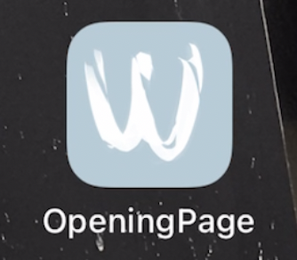
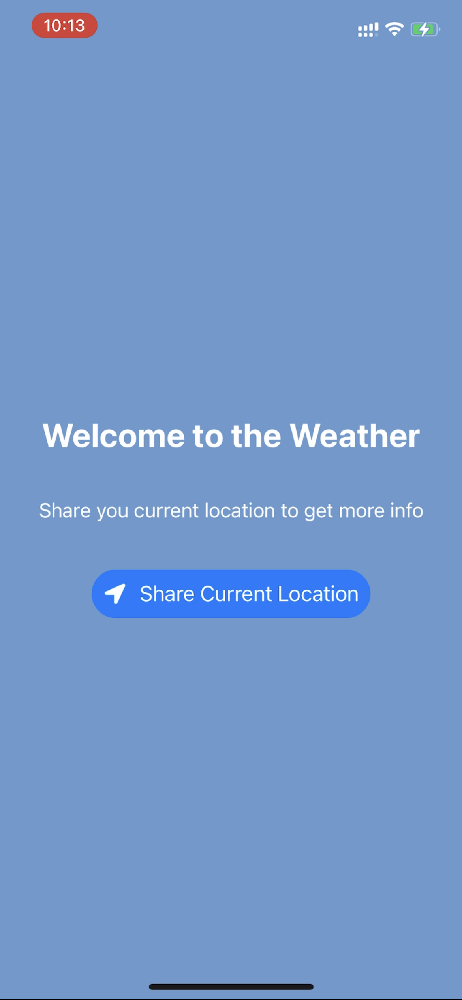
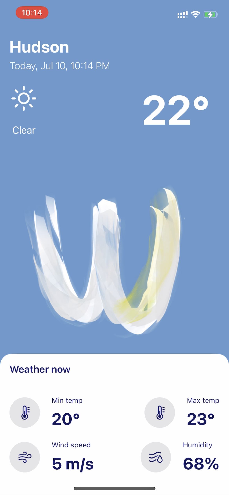

# Weather Report IOS Application

- <h4>This IOS application is built using SwiftUI and it shows the weather based on user's current geographical location using an external API called OpenWeatherMap</h4>

- <h4> Link to the weather API: https://home.openweathermap.org/api_keys

## Demo :
----
### Once user download the application, this would be the icon shown in an iPhone 

----

### Once user open the app this will be the welcome page where it asks user for the consent to access user's location. The Weather App uses user's lattitude and longitude to determine the current weather (including highest, lowest temperature, whether its sunny or cloudy, etc.).

----

### Here is a demo of the weather at a user's current location in Hudson. Detailed information are show on the white tab below and in the center of the screen is the Weather App's icon.

----

## 📹 WWDC videos and SwiftUI

- **2️⃣0️⃣2️⃣1️⃣**
    - **[Add rich graphics to your SwiftUI app](https://developer.apple.com/videos/play/wwdc2021-10021)**
    - **[Craft search experiences in SwiftUI](https://developer.apple.com/videos/play/wwdc2021-10176)**
    - **[Meet async/await in Swift](https://developer.apple.com/videos/play/wwdc2021-10132)**
    - **[What's new in SwiftUI](https://developer.apple.com/videos/play/wwdc2021-10018)**
    - **[Demystify SwiftUI](https://developer.apple.com/videos/play/wwdc2021-10022)**
    - **[Discover concurrency in SwiftUI](https://developer.apple.com/videos/play/wwdc2021-10019)**
    - **[Explore the SF Symbols 3 app](https://developer.apple.com/videos/play/wwdc2021-10288)**
    - **[SF Symbols in SwiftUI](https://developer.apple.com/videos/play/wwdc2021-10349)**
    - **[SwiftUI Accessibility: Beyond the basics](https://developer.apple.com/videos/play/wwdc2021-10119)**
    - **[Direct and reflect focus in SwiftUI](https://developer.apple.com/videos/play/wwdc2021-10023)**
    - **[Localize your SwiftUI app](https://developer.apple.com/videos/play/wwdc2021-10220)**
- **2️⃣0️⃣2️⃣0️⃣**
    - **[Build SwiftUI apps for tvOS](https://developer.apple.com/videos/play/wwdc2020/10042/)**
    - **[Build complications in SwiftUI](https://developer.apple.com/videos/play/wwdc2020/10048/)**
    - **[Introduction to SwiftUI](https://developer.apple.com/videos/play/wwdc2020/10119/)**
    - **[What's new in SwiftUI](https://developer.apple.com/videos/play/wwdc2020/10041/)**
    - **[App essentials in SwiftUI](https://developer.apple.com/videos/play/wwdc2020/10037/)**
    - **[Visually edit SwiftUI views](https://developer.apple.com/videos/play/wwdc2020/10185/)**
    - **[Build a SwiftUI view in Swift Playgrounds](https://developer.apple.com/videos/play/wwdc2020/10643/)**
    - **[Build document-based apps in SwiftUI](https://developer.apple.com/videos/play/wwdc2020/10039/)**
    - **[Stacks, Grids, and Outlines in SwiftUI](https://developer.apple.com/videos/play/wwdc2020/10031/)**
    - **[Build SwiftUI views for widgets](https://developer.apple.com/videos/play/wwdc2020/10033/)**
    - **[Design great widgets](https://developer.apple.com/videos/play/wwdc2020/10103)**
    - **[Widget Code-along](https://developer.apple.com/videos/play/wwdc2020/10034/)**
    - **[Data Essentials in SwiftUI](https://developer.apple.com/videos/play/wwdc2020/10040/)**
    - **[Structure your app for SwiftUI previews](https://developer.apple.com/videos/play/wwdc2020/10149/)**
- **2️⃣0️⃣1️⃣9️⃣**
    - **[Introducing SwiftUI: Building Your First App](https://developer.apple.com/videos/play/wwdc2019/204/)**
    - **[SwiftUI Essentials](https://developer.apple.com/videos/play/wwdc2019/216)** 🌟
    - **[Data Flow Through SwiftUI](https://developer.apple.com/videos/play/wwdc2019/226)**
    - **[Building Custom Views with SwiftUI](https://developer.apple.com/videos/play/wwdc2019/237)** 🌟
    - **[Integrating SwiftUI](https://developer.apple.com/videos/play/wwdc2019/231)**
    - **[Accessibility in SwiftUI](https://developer.apple.com/videos/play/wwdc2019/238)**
    - **[SwiftUI On All Devices](https://developer.apple.com/videos/play/wwdc2019/240)**
    - **[SwiftUI on watchOS](https://developer.apple.com/videos/play/wwdc2019/219)**
    - **[Mastering Xcode Previews](https://developer.apple.com/videos/play/wwdc2019/233)**
